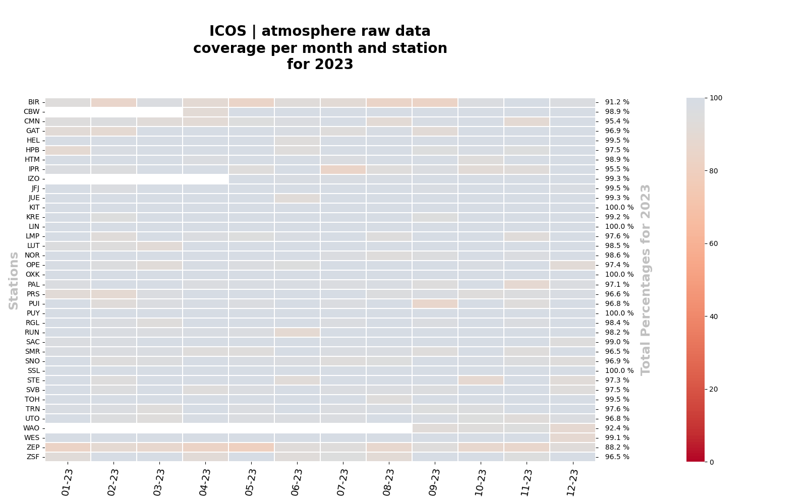
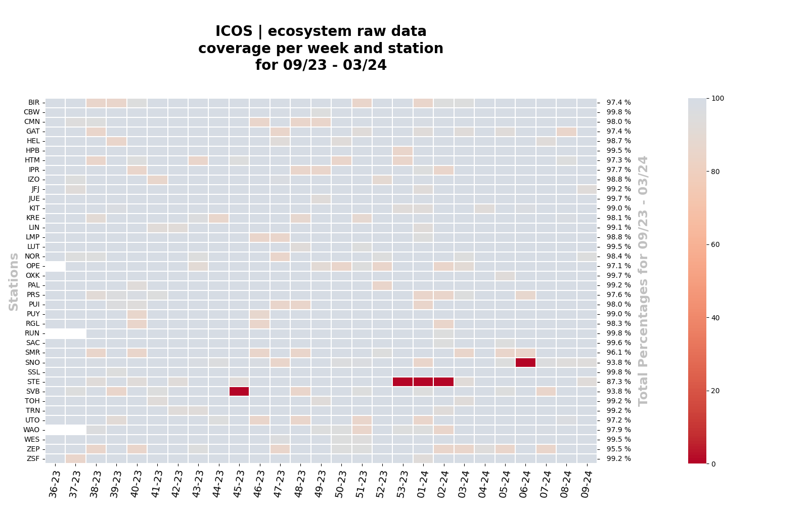

## ICOS Heatmaps
An application to fetch and plot raw data from the ICOS Carbon Portal as 
submitted by the measurement stations of the Ecosystem and Atmosphere domains.

## How to run
- Install the needed dependencies using `pip install -r requirements.txt`
- Customize your settings by filling in the details in `settings.yml`. Please
  see the section below for a detailed explanation.
- Run `python3 runner.py`.
- Find generated plots and data in the custom output path specified in the 
application's settings. 

## Settings
- `domain`: The value of this setting can be one of these: ["atc", "etc"].
- `start`: A string value representing the start datetime for slicing raw data.
- `end`: A string value representing the end datetime for slicing raw data.
- `group`: The value of this setting controls the binning of the raw data. It 
can be set to "M" for monthly bins or "W" for weekly bins.
- `title_period`: A string value that controls the time period in the title of 
the `.png` plot.
- `side_title_period`: A string value that controls the time period in the side 
title of the `.png` plot.
- `file_name_period`: A string value that controls the time period in the names
of the `.png` and `.csv` files.
- `output_dir`: The location where the generated files will be saved.

## Generated heatmaps examples

